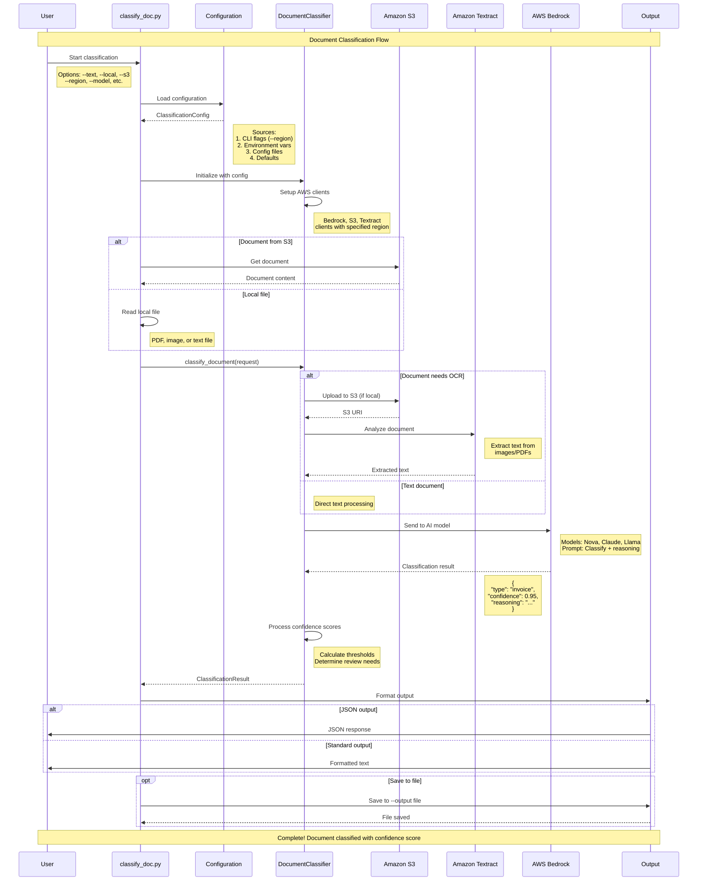
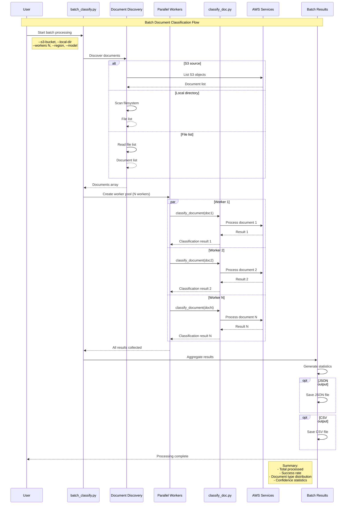

# GenAI Document Classification

A production-ready document classification system with **17 AI models** on AWS Bedrock, providing confidence scores from 0.30-0.95 for comprehensive testing and production use.

## 🚀 Quick Start

```bash
# Insta## 🔄 Process Flow Diagram

The following sequence diagrams show the complete document classification process:

> **💡 Note**: These Mermaid diagrams will render automatically on GitHub, GitLab, and other platforms that support Mermaid. For local viewing, use a Markdown viewer with Mermaid support or the [Mermaid Live Editor](https://mermaid.live/).

### Single Document Classification

```mermaidpendencies
uv sync

# Classify text with default model
uv run python classify_doc.py --text "Invoice #12345 Amount Due: $1,500.00"

# Use specific model
uv run python classify_doc.py --text "Please review this agreement" --model nova-lite

# Process local documents in batch
cd batch/
./batch_classify.sh --local-dir ../data --pattern "*.pdf" --workers 4

# List all 17 available models
uv run python classify_doc.py --list-models
```

## 📊 Available Models (17 Total)

| Provider | Models | Speed | Confidence Range | Best For |
|----------|---------|--------|------------------|----------|
| **Amazon Nova** | Lite, Pro, Premier | Fast-Slow | 0.85-0.95 | Consistent results, production |
| **Anthropic Claude** | 3 Sonnet, 3.5 Sonnet, 3.7 Sonnet, Sonnet 4, 3 Haiku, 3.5 Haiku | Medium-Slow | 0.30-0.95 | Low confidence testing |
| **DeepSeek** | R1 | Medium | 0.85-0.95 | Advanced reasoning |
| **Meta Llama** | 3.1 (8B, 70B), 3.2 (1B, 3B, 11B, 90B), 3.3 (70B) | Very Fast-Slow | 0.85-0.99 | High-volume processing |

## 🎯 Document Types Supported

## 🎯 Document Types Supported

The system classifies documents into **27 categories**:

**Financial**: invoice, receipt, bank_statement, financial_report, tax_document  
**Legal**: contract, legal_document, court_filing  
**HR**: resume, job_application, performance_review  
**Medical**: medical_record, prescription, lab_result, insurance_claim  
**Administrative**: form, application, permit, license, certificate  
**Communication**: email, letter, memo  
**Other**: report, proposal, manual, other

## 📁 Project Structure

```
genai-doc-classification/
├── classify_doc.py              # 🎯 Main CLI tool
├── batch/                       # 🚀 Batch processing tools
│   ├── batch_classify.py        #   Advanced Python processor
│   ├── batch_classify.sh        #   Shell wrapper script
│   └── README.md               #   Batch processing guide
├── models.py                    # 📊 Data models & document types
├── classifier.py                # 🧠 Core classification logic
├── config.py                    # ⚙️ Configuration management
├── data/                        # 📄 Sample documents for testing
├── scripts/                     # 🔧 Testing and utility scripts
└── docs/                        # 📚 Additional documentation
```

## 🔧 Usage Examples

### Single Document Classification

```bash
# Text input
uv run python classify_doc.py --text "Invoice #12345 Amount Due: $1,500.00"

# Local file
uv run python classify_doc.py --local data/invoice.pdf

# S3 document  
uv run python classify_doc.py --s3 my-bucket documents/invoice.pdf

# With specific model, region, and verbose output
uv run python classify_doc.py --local data/contract.pdf --model claude-3-sonnet --region us-west-2 --verbose
```

### Batch Processing

```bash
# Navigate to batch directory
cd batch/

# Process local directory
./batch_classify.sh --local-dir ../data --pattern "*.pdf" --workers 4

# Process S3 bucket
./batch_classify.sh --s3-bucket my-docs --prefix documents/ --workers 8

# Fast processing with nova-lite in custom region
./batch_classify.sh --local-dir ../data --model nova-lite --region us-west-2 --workers 6

# Advanced Python processor with all options
python batch_classify.py \
  --s3-bucket my-bucket \
  --prefix documents/ \
  --pattern "*.pdf" \
  --workers 12 \
  --model claude-sonnet \
  --region eu-central-1 \
  --timeout 300 \
  --max-docs 100 \
  --output results \
  --format both \
  --progress \
  --verbose
```

## ⚙️ Configuration

### AWS Setup
```bash
# Configure AWS credentials
aws configure

# Or use environment variables
export AWS_PROFILE=your-profile
export AWS_REGION=us-west-2  # Set your preferred region
```

**Region Configuration**: The system now automatically detects your AWS region from:
1. `AWS_REGION` environment variable
2. `AWS_DEFAULT_REGION` environment variable  
3. AWS configuration file
4. Fallback to `us-east-1` if none are set

### Model Selection Guide

| Use Case | Recommended Model | Workers | Throughput |
|----------|-------------------|---------|------------|
| **High Volume** | nova-lite | 6-8 | ~1.3 docs/sec |
| **Balanced** | claude-3-haiku | 4-6 | ~0.5 docs/sec |
| **High Quality** | claude-3-sonnet | 2-4 | ~0.3 docs/sec |
| **Testing/Development** | claude-3-5-haiku | 2-3 | ~0.4 docs/sec |

### S3 Configuration

```python
# config.py example
S3Config(
    input_bucket="my-documents",
    output_bucket="my-results", 
    region="us-west-2",  # Optional - will auto-detect if not specified
    prefix="documents/",
    results_prefix="classifications/"
)
```

## 📊 Output Formats

### JSON Output (Detailed)
```json
{
  "document_id": "invoice_001",
  "document_type": "invoice",
  "confidence": 0.95,
  "confidence_level": "Very High",
  "high_confidence": true,
  "needs_review": false,
  "reasoning": "Document contains itemized charges, tax amounts, and payment terms typical of invoices.",
  "processing_time_ms": 2150
}
```

### CSV Output (Summary)
```csv
document_id,document_type,confidence,confidence_level,needs_review
invoice_001,invoice,0.95,Very High,false
receipt_002,receipt,0.89,High,false
contract_003,contract,0.92,Very High,false
```

## 🧪 Testing & Development

```bash
# Run comprehensive test suite
uv run python scripts/test_suite.py

# Test specific model
uv run python scripts/test_suite.py --model nova-lite

# Create sample data
uv run python scripts/create_test_data.py

# Performance testing
cd batch/
./batch_classify.sh --local-dir ../data --model nova-lite --workers 8
```

## 🔍 Troubleshooting

### Common Issues

**1. Model name errors**
```bash
# ❌ Wrong
./batch_classify.sh --model claude-sonnet-3

# ✅ Correct  
./batch_classify.sh --model claude-3-sonnet
```

**2. AWS credentials**
```bash
# Check credentials
aws configure list
aws sts get-caller-identity
```

**3. S3 permissions**
```bash
# Test S3 access
aws s3 ls s3://your-bucket/
```

**4. Path issues from root directory**
```bash
# Use batch directory directly
cd batch/
./batch_classify.sh --local-dir ../data --pattern "*.pdf"
```

### Performance Tips

1. **Use nova-lite** for high-volume processing (1.3 docs/sec)
2. **Adjust workers** based on AWS API limits (start with 2-4)
3. **Process in batches** of 100-1000 documents
4. **Use S3 prefixes** to filter documents efficiently
5. **Monitor AWS costs** with different model choices

## 🏗️ Architecture

The system integrates with the broader AWS Intelligent Document Processing (IDP) accelerator:

- **AWS Bedrock** - Multiple AI model access
- **Amazon Textract** - OCR for scanned documents  
- **Amazon S3** - Document storage and results
- **AWS Lambda** - Serverless processing (when deployed)
- **Amazon DynamoDB** - Metadata and results storage

## � Process Flow Diagram

The following sequence diagram shows the complete document classification process:



### Key Process Steps

1. **Initialization**: CLI loads configuration from multiple sources (flags > env vars > files > defaults)
2. **AWS Setup**: Initialize clients for Bedrock, S3, and Textract with specified region
3. **Document Retrieval**: Fetch from S3, read local file, or use direct text input
4. **Text Extraction**: Use Textract for OCR if document is image/PDF format
5. **AI Classification**: Send extracted text to chosen Bedrock model for classification
6. **Result Processing**: Calculate confidence scores and determine if human review is needed
7. **Output**: Return structured results in JSON or formatted text

### Batch Processing Flow

For high-volume document processing, the system supports parallel batch operations:



### Understanding the Flow

**Single Document Flow**:
- Documents can come from three sources: direct text, local files, or S3
- OCR (Textract) is only used for image/PDF files that need text extraction
- All requests go through the same Bedrock AI model for classification
- Results include confidence scores and reasoning for transparency

**Batch Processing Flow**:
- Supports parallel processing with configurable worker count
- Each worker runs independent classification processes
- Results are aggregated and provide comprehensive statistics
- Optimized for high-volume document processing (100s-1000s of documents)

**Key Design Principles**:
- **Flexibility**: Multiple input sources and output formats
- **Scalability**: Parallel processing and configurable workers
- **Reliability**: Timeout handling and error recovery
- **Transparency**: Detailed logging and confidence scoring
- **Region-Aware**: Full AWS region customization support

## �🚦 API Limits & Costs

| Model | Requests/min | Tokens/min | Relative Cost |
|-------|--------------|------------|---------------|
| nova-lite | 200 | 200K | $ |
| claude-haiku | 100 | 100K | $$ |
| claude-sonnet | 50 | 50K | $$$ |
| llama-3.2-1b | 300 | 300K | $ |

## 📈 Performance Benchmarks

Based on processing 3 sample documents (invoice, receipt, medical form):

| Model | Avg Time | Success Rate | Confidence Range |
|-------|----------|--------------|------------------|
| nova-lite | 1.8s | 100% | 0.85-0.95 |
| claude-3-sonnet | 4.6s | 100% | 0.90-0.95 |
| claude-3-haiku | 2.1s | 100% | 0.85-0.92 |

## 🔗 Related Documentation

- **Batch Processing**: See [`batch/README.md`](batch/README.md) for detailed batch processing guide
- **AWS IDP Accelerator**: Main project documentation in parent directory
- **API Reference**: Function and class documentation in source code
- **Configuration**: Advanced configuration options in `config.py`

## 📝 License

This project is licensed under the Apache License 2.0 - see the [LICENSE](../LICENSE) file for details.

## 🤝 Contributing

1. Fork the repository
2. Create a feature branch
3. Make your changes
4. Add tests and documentation
5. Submit a pull request

For detailed contributing guidelines, see [CONTRIBUTING.md](../CONTRIBUTING.md).
